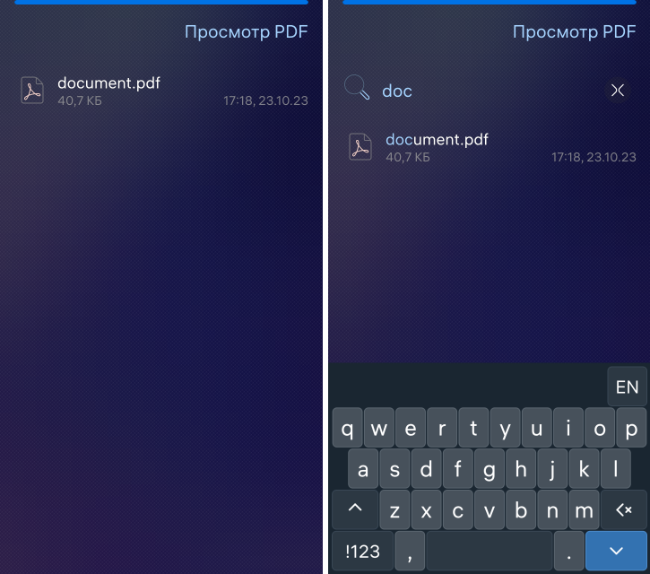

# Tiny PDF Viewer

The project provides an example of a PDF viewer based on PDFium.

The main purpose is to demonstrate using a minimum of source code to get a correct and extensible application.

## Terms of Use and Participation

The source code of the project is provided under [the license](LICENSE.BSD-3-CLAUSE.md),
which allows its use in third-party applications.

The [contributor agreement](CONTRIBUTING.md) documents the rights granted by contributors
of the Open Mobile Platform.

Information about the contributors is specified in the [AUTHORS](AUTHORS.md) file.

[Code of conduct](CODE_OF_CONDUCT.md) is a current set of rules of the Open Mobile
Platform which informs you how we expect the members of the community will interact
while contributing and communicating.

## Project Structure

The project has a standard structure
of an application based on C++ and QML for Aurora OS.

* **[ru.auroraos.TinyPdfViewer.pro](ru.auroraos.TinyPdfViewer.pro)** file
        describes the project structure for the qmake build system.
* **[icons](icons)** directory contains the application icons for different screen resolutions.
* **[qml](qml)** directory contains the QML source code and the UI resources.
   * **[cover](qml/cover)** directory contains the application cover implementations.
   * **[icons](qml/icons)** directory contains the additional custom UI icons.
   * **[pages](qml/pages)** directory contains the application pages.
   * **[ru.auroraos.TinyPdfViewer.qml](qml/ru.auroraos.TinyPdfViewer.qml)** file
                provides the application window implementation.
* **[rpm](rpm)** directory contains the rpm-package build settings.
   * **[ru.auroraos.TinyPdfViewer.spec](rpm/ru.auroraos.TinyPdfViewer.spec)** file
                is used by rpmbuild tool.
* **[src](src)** directory contains the C++ source code.
   * **[main.cpp](src/main.cpp)** file is the application entry point.
   * **[filesmodel.h](src/filesmodel.h)** file is the application entry point.
* **[translations](translations)** directory contains the UI translation files.
* **[ru.auroraos.TinyPdfViewer.desktop](ru.auroraos.TinyPdfViewer.desktop)** file
        defines the display and parameters for launching the application.

## Compatibility

The project is compatible with all the current versions of the Aurora OS.

## Working flow

- [FilesModel](src/filesmodel.h) provides a list model of the PDF files, stored on device.
  The [FilesPage](qml/pages/FilesPage.qml) uses SilicaListView to display of
  these files.

- The list of the PDF files is a result of the Tracker3 DBus query. 
  Tracker3 DBus call is executed in the [TrackerQueryWorker](src/trackerqueryworker.h).

- [DBusAdaptor](src/dbusadaptor.h) implements a DBus service to open the PDF files on an external
  query. The adaptor emits [fileOpenRequested](src/dbusadaptor.h#L57) signal when the DBus method 
  [openFile](src/dbusadaptor.h#L54) is called. That signal activates
  [Application](qml/ru.auroraos.TinyPdfViewer.qml#L49) and sends the file path to the [FilesPage](qml/pages/FilesPage.qml#L287).

- [ContentPage](qml/pages/ContentPage.qml#L145) uses a PdfView qml type from ru.omp.amberpdf plugin
  to show the PDF document content. That plugin can render PDF document in horizontal and
  vertical orientations, draw annotations, notes. PdfView supports fast scroll, navigation,
  bookmarks, notes content. It is simple to use and we recommend to use in your application.

## Screenshots

## This document in Russian / Перевод этого документа на русский язык

- [README.ru.md](README.ru.md)
